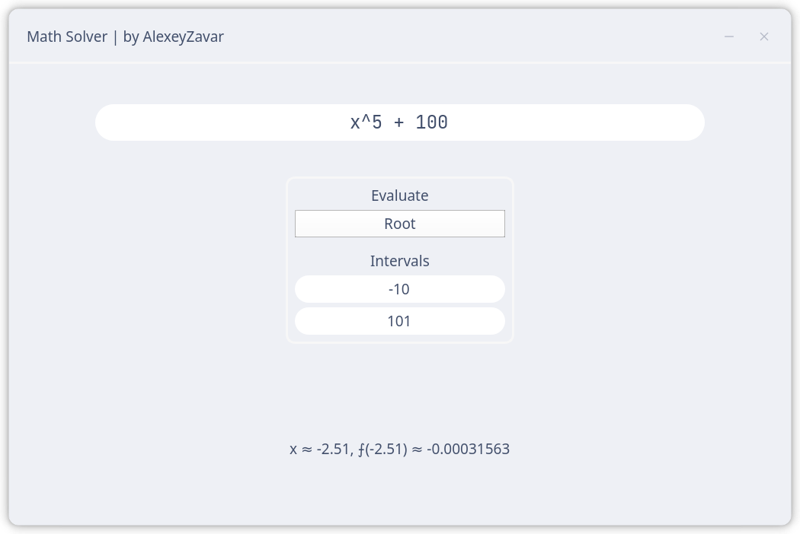
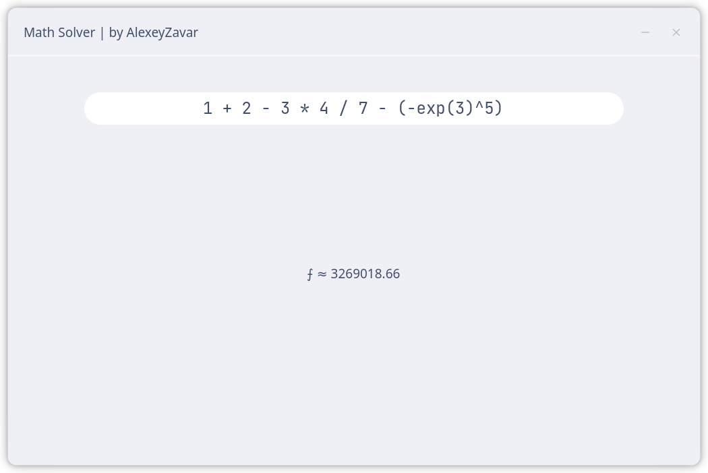
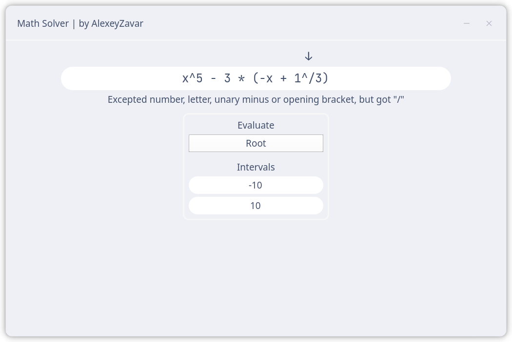

# Calculator







## Task

Develop stack-based calculator that can evaluate expressions, find root(s) and calculate integral.

## Features

- Verify & evaluate expressions **on-the-fly**
- Autocompletion & autoformatting input box
- Find root on the specified range (**Secants method**)
- Calculate integral on the specified range (**Simpson's method**)

## How to run

```shell
git clone https://github.com/ZavaruKitsu/stack_calculator
cd stack_calculator

# setup virtual environment
python -m venv venv
pip install -r requirements.txt

# run gui
python main.py
```

## Project structure

> main.py

GUI.

> tests.py

Tests for evaluator.

### src/evaluator

**Lexer** - transforms given string into the list of lexemes.

**Tokenizer** - transforms list of lexemes into the list of Tuples as follows: `(LEXEME_TYPE, LEXEME)`.

**Converter** - transforms list of tokens into the *Reverse Polish notation*.

**Evaluator** - stack-based calculator that can evaluate expression or function.

**EasyWrapper** - wrapper around all above classes, made for ease of use.

### src/gui

**MathInput** - input box that verifies given expression and also points at the error.

**MathWindow** - just a main window.

**OptionsWidget** - widget that allows to configure calculator mode.

**TitleBarWidget** - as well as it sounds.

## Credits

- Icons8 for `close.svg, minimize.svg`
